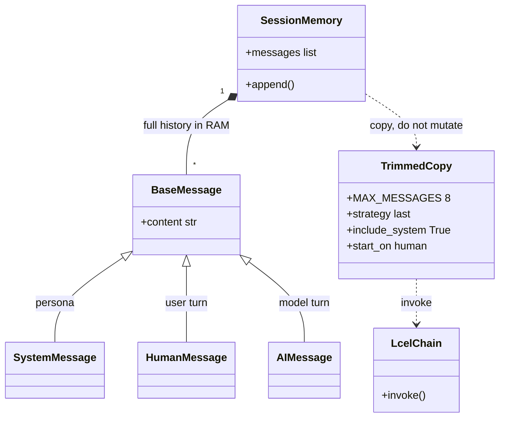
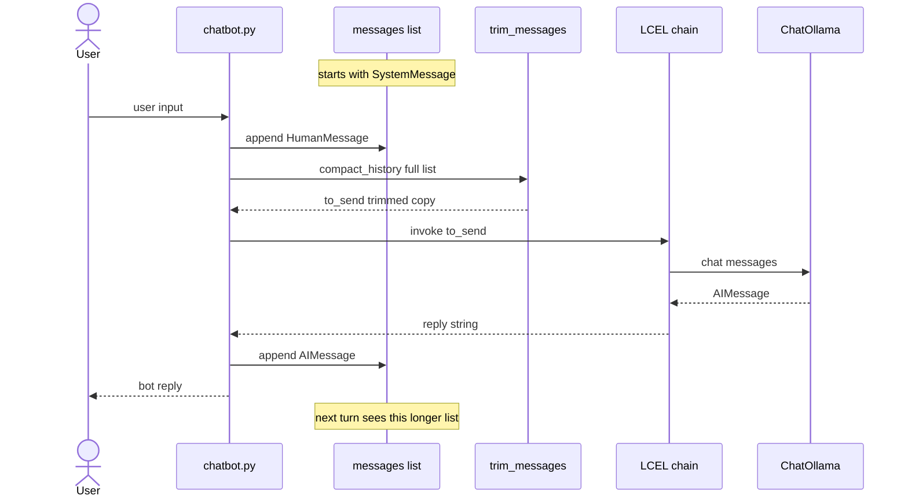

# Study notes — langchain-first-chain

Notes for what this repo actually uses so far. Not a full LangChain textbook.

Two scripts:

- `first_chain.py` — one prompt, one answer, no memory between questions.
- `chatbot.py` — multi-turn messages + `trim_messages`.

## Big picture

The app is one **LCEL chain**:

```text
user topic  →  prompt  →  model  →  parser  →  string on screen
```

- **Prompt**: turn a dict like `{"topic": "LCEL"}` into chat messages.
- **Model**: send those messages to a local LLM (Ollama).
- **Parser**: turn the model reply into a plain `str`.

LCEL is just composing these steps with `|`:

```python
chain = prompt | model | parser
```

Each piece is a **Runnable**. `invoke` on the chain runs them in order. The chain input is a **dict**, not a raw string, because the prompt template has named variables.

## Prompt: `ChatPromptTemplate`

Two styles:

| API | What it is |
|-----|------------|
| `from_template("...{topic}...")` | One human message. Fine for a first demo. |
| `from_messages([...])` | List of roles. This project uses this. |

Roles we use:

- **system**: standing instructions (be a tutor; do not mix up names). The model is more likely to follow this than a one-line human prompt.
- **human**: the actual user request. `{topic}` is filled at invoke time.

`"{topic}"` in the template is **not** an f-string. LangChain substitutes it when you call `chain.invoke({"topic": topic})`. If the key is missing, invoke fails.

## Model: `ChatOllama` vs Ollama

They are not the same program.

| Piece | What it is |
|-------|------------|
| **Ollama** | Native app / background service. Speaks HTTP (default `localhost:11434`). Holds models like `llama3.2`. Install globally; `ollama serve`, `ollama pull`. |
| **`langchain-ollama.ChatOllama`** | Python client inside the venv. Builds chat requests and talks to that service. |

If Ollama is down, the Python chain fails even if `pip install` succeeded.

`temperature=0` means more deterministic answers. It does **not** mean "always factually correct".

## Parser: `StrOutputParser`

Chat models return a **message object** (role + content + metadata). The parser pulls out `.content` as a `str`, so `print(result)` is readable.

Without it you would print something like an `AIMessage(...)`.

## Running the chain

```python
result = chain.invoke({'topic': topic})
```

- **`invoke`**: wait for the full answer, then return.
- **`stream`**: yield chunks as they arrive (mentioned in README, not used in code yet).
- **`batch`**: several inputs at once (not used yet).

In `first_chain.py`, the `while True` + `input()` loop is ordinary Python. It is **not** LangChain memory. Each `invoke` is a **new, independent** request.

`chatbot.py` is the version that **does** pass history (see below).

`if __name__ == '__main__'` keeps chain construction importable without starting the CLI.

## Hallucination (what we already saw)

The first run explained LangChain as a **blockchain** framework. The pipeline was correct; the **model guessed** from the word "Chain".

Takeaways:

- A working chain ≠ a true answer.
- Small local models hallucinate more, especially with short prompts.
- A **system** message that names the confusion (LLM framework, not blockchain) is a cheap mitigation, not a guarantee.

## Python env (setup, not LCEL)

For this project:

- **In the venv**: Python + `langchain` / `langchain-core` / `langchain-ollama` (PyPI).
- **Global**: Ollama app + pulled models; Git; editor.

`pip` + `venv` is enough because everything we import is on PyPI.

Windows **Git Bash** uses forward slashes:

```bash
source .venv/Scripts/activate
```

Backslash is an escape in bash (`.venv\Scripts\activate` becomes `.venvScriptsactivate`). Unix layouts use `.venv/bin/activate`; Windows venvs use `.venv/Scripts/`.

## Packages (what each one is for)

- `langchain-core`: prompts, parsers, LCEL primitives.
- `langchain-ollama`: `ChatOllama`.
- `langchain`: umbrella / extra integrations; this tiny script mostly needs the two above.

## Chatbot memory (`chatbot.py`)

Short-term memory is just a **list of messages** kept in the process:

```text
[system, human, ai, human, ai, ...]
```

Each turn we append a `HumanMessage`, `invoke` the chain, then append an `AIMessage`. The next call includes those earlier messages, so "My name is Ada" then "What is my name?" can work.



One turn (the list grows; only the trimmed copy is sent):



`MessagesPlaceholder('messages')` means: do not template a single `{topic}`; inject this list as the prompt. The chain is still LCEL: `prompt | model | parser`. Input is `{"messages": ...}`.

This list dies when the process exits. That is still **short-term / session** memory, not a database.

## Compression: `trim_messages`

Unbounded history will blow the context window. `chatbot.py` keeps the full list in RAM, but only sends a **trimmed copy** to the model.

```python
trim_messages(
    messages,
    max_tokens=MAX_MESSAGES,
    token_counter=len,   # each message counts as 1, so this is "max messages"
    strategy='last',
    include_system=True,
    start_on='human',
)
```

| Arg | Meaning |
|-----|---------|
| `strategy='last'` | Keep the **recent** tail; drop old turns first. `'first'` would keep the beginning and forget what you just said. |
| `include_system=True` | Always keep the `SystemMessage` at index 0 (persona). Otherwise `'last'` would drop it. |
| `start_on='human'` | After the cut, drop a leftover prefix until a `HumanMessage` (do not start on a dangling `AIMessage`). Does not strip the kept system message. |

`token_counter=len` is for learning. Later you can use `token_counter='approximate'` or the chat model to trim by real tokens.

When the CLI prints `sending N of M messages` and `N < M`, older turns were dropped. The model can forget the name even though the Python list still has it.

This is **hard** compression (delete). **Soft** compression would summarize old turns into one paragraph instead of dropping them — not in the code yet.

## Not in the code yet (next concepts)

- Streaming (`chain.stream`)
- CLI flags (`argparse`)
- Structured output (Pydantic)
- Summarize old messages instead of trimming them away
- Persist sessions (`session_id`, disk, or a LangGraph checkpointer)
- Tools / agents / RAG (RAG "compression" is about documents, not chat history)
