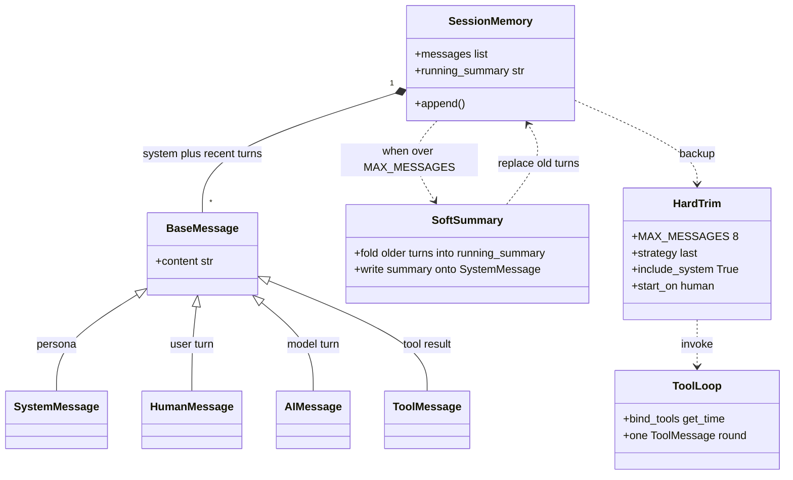
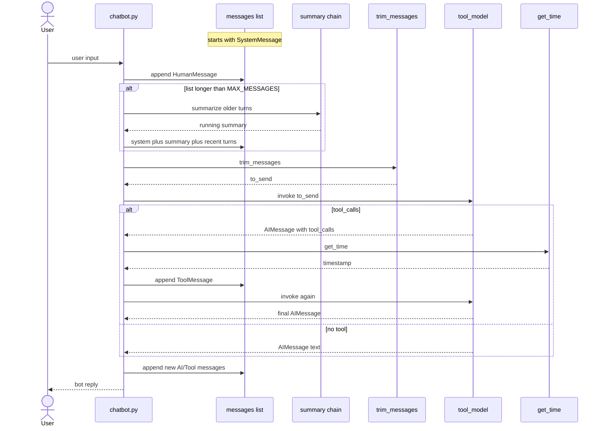

# Study notes — langchain-first-chain

Notes for what this repo actually uses so far. Not a full LangChain textbook.

Three scripts:

- `first_chain.py` — one prompt, one answer, no memory between questions.
- `extract_paragraph.py` — one paste, Pydantic fields (`summary`, `paragraph_count`, `author`, `published_at`).
- `chatbot.py` — multi-turn messages + `trim_messages`.

## Big picture

The app is one **LCEL chain**:

```text
user topic  →  prompt  →  model  →  parser  →  string on screen
```

- **Prompt**: turn a dict like `{"topic": "LCEL"}` into chat messages.
- **Model**: send those messages to a local LLM (Ollama).
- **Parser**: turn the model reply into a plain `str`.

LCEL is just composing these steps with `|`:

```python
chain = prompt | model | parser
```

Each piece is a **Runnable**. `invoke` on the chain runs them in order. The chain input is a **dict**, not a raw string, because the prompt template has named variables.

## Prompt: `ChatPromptTemplate`

Two styles:

| API | What it is |
|-----|------------|
| `from_template("...{topic}...")` | One human message. Fine for a first demo. |
| `from_messages([...])` | List of roles. This project uses this. |

Roles we use:

- **system**: standing instructions (be a tutor; do not mix up names). The model is more likely to follow this than a one-line human prompt.
- **human**: the actual user request. `{topic}` is filled at invoke time.

`"{topic}"` in the template is **not** an f-string. LangChain substitutes it when you call `chain.invoke({"topic": topic})`. If the key is missing, invoke fails.

## Model: `ChatOllama` vs Ollama

They are not the same program.

| Piece | What it is |
|-------|------------|
| **Ollama** | Native app / background service. Speaks HTTP (default `localhost:11434`). Holds models like `llama3.2`. Install globally; `ollama serve`, `ollama pull`. |
| **`langchain-ollama.ChatOllama`** | Python client inside the venv. Builds chat requests and talks to that service. |

If Ollama is down, the Python chain fails even if `pip install` succeeded.

`temperature=0` means more deterministic answers. It does **not** mean "always factually correct".

## Parser: `StrOutputParser`

Chat models return a **message object** (role + content + metadata). The parser pulls out `.content` as a `str`, so `print(result)` is readable.

Without it you would print something like an `AIMessage(...)`.

## Running the chain

```python
result = chain.invoke({'topic': topic})
```

- **`invoke`**: wait for the full answer, then return (`first_chain.py`, the summarizer, and chatbot replies so `tool_calls` stay visible).
- **`stream`**: yield chunks as they arrive (not used for chatbot replies anymore; a string stream would hide tool calls).
- **`batch`**: several inputs at once (not used yet).

In `first_chain.py`, the `while True` + `input()` loop is ordinary Python. It is **not** LangChain memory. Each `invoke` is a **new, independent** request.

`chatbot.py` is the version that **does** pass history (see below).

`if __name__ == '__main__'` keeps chain construction importable without starting the CLI.

## Hallucination (what we already saw)

The first run explained LangChain as a **blockchain** framework. The pipeline was correct; the **model guessed** from the word "Chain".

Takeaways:

- A working chain ≠ a true answer.
- Small local models hallucinate more, especially with short prompts.
- A **system** message that names the confusion (LLM framework, not blockchain) is a cheap mitigation, not a guarantee.

## Python env (setup, not LCEL)

For this project:

- **In the venv**: Python + `langchain` / `langchain-core` / `langchain-ollama` (PyPI).
- **Global**: Ollama app + pulled models; Git; editor.

`pip` + `venv` is enough because everything we import is on PyPI.

Windows **Git Bash** uses forward slashes:

```bash
source .venv/Scripts/activate
```

Backslash is an escape in bash (`.venv\Scripts\activate` becomes `.venvScriptsactivate`). Unix layouts use `.venv/bin/activate`; Windows venvs use `.venv/Scripts/`.

## Packages (what each one is for)

- `langchain-core`: prompts, parsers, LCEL primitives, `@tool`, `ToolMessage`.
- `langchain-ollama`: `ChatOllama`.
- `langchain`: umbrella / extra integrations; this tiny script mostly needs the two above.
- `pydantic`: field schemas for `extract_paragraph.py` (LangChain already depends on it; listed explicitly).

## Structured output (`extract_paragraph.py`)

`StrOutputParser` gives one string. Structured output gives **typed fields** the rest of the program can use without regex.

A single `answer` field would just wrap the same chatbot string in JSON. Four fields make the schema the point of the lesson:

| Field | Type | Rule |
|-----|------|------|
| `summary` | `str` | A few sentences covering the paste. |
| `paragraph_count` | `int` | How many paragraphs the model thinks are in the text. |
| `author` | `str \| None` | Only if the text states an author; else null. Do not invent. |
| `published_at` | `str \| None` | `YYYY-MM-DD` only if the text states a date; else null. |

The chain is still LCEL. The last step is Ollama's JSON schema instead of a string parser:

```python
structured_model = model.with_structured_output(
    ParagraphExtract,
    method='json_schema',
    include_raw=True,
)
chain = prompt | structured_model
```

`method='json_schema'` uses Ollama's structured-output `format`. `include_raw=True` means a bad parse is `{raw, parsed, parsing_error}` instead of crashing the CLI. We print `(structured: parse failed)` and the raw text; we do not invent fields.

`invoke` waits for the full object (no token streaming). Streaming JSON would print `{ "summary": ...` which is not useful here.

Each `invoke` is independent, like `first_chain.py`. There is no message list.

**Python paragraph count:** `count_paragraphs` splits on blank lines (`\n\n`). The CLI prints it next to the model's `paragraph_count` so you can see when the LLM miscounts. That check is ordinary Python, not a second model call.

A one-line `input()` paste usually has `python count: 1`. Two paragraphs in one paste need a blank line between them (`\n\n`).

`chatbot.py` is unchanged: facts still use regex; replies still stream. Applying Pydantic there is a later optional tweak.

## Chatbot memory (`chatbot.py`)

Short-term memory is just a **list of messages** kept in the process:

```text
[system, human, ai, human, ai, ...]
```

Each turn we append a `HumanMessage`, `invoke` the bound model (so `tool_calls` survive), maybe append `ToolMessage`, then append the final `AIMessage`. The next call includes those earlier messages, so "My name is Ada" then "What is my name?" can work.



One turn (summarize old turns if needed, then hard-trim as backup):



`MessagesPlaceholder('messages')` means: do not template a single `{topic}`; inject this list as the prompt. The reply chain is LCEL: `prompt | tool_model` (no string parser). Input is `{"messages": ...}`.

The in-process list is still **short-term** memory: it is what this request sends to the model. **Long-term** memory is `sessions/<session_id>.json` (`facts`, `topic_notes`, human/ai/**tool** turns). A new process with the same id loads that file. `SystemMessage` is not stored; `make_system` rebuilds it so the persona text can change without stale JSON.

This is ordinary `json` + a file, not a LangGraph checkpointer. A different session id is a different file, so `ada` does not see `bob`.

## One tool (`get_time`)

Not `create_agent`. The model is `model.bind_tools([get_time])`. Python runs at most **one** tool round:

```text
invoke
  -> if AIMessage.tool_calls: run get_time, append ToolMessage, invoke again
  -> print the final text
```

`ToolMessage.tool_call_id` must match the `id` on the `AIMessage` that requested the tool. A `ToolMessage` with no preceding tool-call `AIMessage` is an invalid history — that is why hard trim uses `start_on='human'` (drop a leftover `ToolMessage` / tool-call `AIMessage` after the cut). Soft compression walks the recent tail left until it starts on a `HumanMessage` for the same reason.

JSON stores `tool_calls` on `role: ai` and `role: tool` with `tool_call_id`. Reloading must keep the pair together.

## Compression: soft summary, then hard `trim_messages`

Unbounded history will blow the context window. Each `invoke` only sees what we send **this turn**.

Pipeline in `chatbot.py`:

```text
full messages
    -> if too many messages OR too many tokens: summarize older turns (soft)
       (facts stay in a Python dict on the SystemMessage; recent turns stay verbatim)
    -> trim_messages by approximate tokens (hard, backup)
    -> model
```

**Soft** (first): old `Human`/`AI` turns are folded into **topic notes** by a second LCEL chain. **Personal facts** (name, favorite color, …) are harvested with regex into a Python dict and always written onto the `SystemMessage`. The summarizer is not allowed to overwrite those facts. If the summarizer returns a safety refusal or echoes the prompt, we **keep the previous topic notes**.

That failure happened in testing: the first summary still had `Marcus`; the next summarizer call returned `I can't create content that sexualizes a child` and replaced the whole memory. Soft compression was running; the LLM summary was just a bad store for names.

Recent turns (`KEEP_RECENT_MESSAGES = 7`) stay as original messages, including the current human question. Soft compression also starts if approximate tokens go above `SUMMARY_TRIGGER_TOKENS` (1400), even when there are still few messages.

**Hard** (second): `trim_messages` caps the **token** budget (`MAX_CONTEXT_TOKENS = 2048`), not the message count. A long `SystemMessage` is still 1 message but can use hundreds of tokens. `token_counter='approximate'` is a fast estimate (not the Ollama tokenizer). `include_system=True` keeps persona + known facts.

```python
trim_messages(
    messages,
    max_tokens=MAX_CONTEXT_TOKENS,
    token_counter='approximate',
    strategy='last',
    include_system=True,
    start_on='human',
)
```

| Arg | Meaning |
|-----|---------|
| `strategy='last'` | Keep the **recent** tail; drop old turns first. `'first'` would keep the beginning and forget what you just said. |
| `include_system=True` | Always keep the `SystemMessage` at index 0 (persona **and** the running summary). |
| `start_on='human'` | After the cut, drop a leftover prefix until a `HumanMessage`. Stops a dangling `ToolMessage` or tool-call `AIMessage` from being the first non-system message. |

`token_counter=len` (old) counted each message as 1. That was easier to demo, but it is not how the model window works.

When the CLI prints `~890/2048 tokens`, that is the approximate size of **this request**. If it also prints `was ~2100`, hard trim dropped tokens. `(known facts: ...)` is the Python-owned pin (names survive even if topic notes fail). `(topic notes: ...)` is the LLM summary.

Hard trim alone used to print `sending 8 of 32` and forget the name. Soft-then-hard is meant to avoid that — but only if the summarizer does not wipe the memory. That is why facts are pinned outside the LLM.

## Not in the code yet (next concepts)

See README “Later concepts”: RAG / LangGraph / a web UI stay out of this repo for now. Chatbot facts still use regex. JSON sessions are on disk; this tiny agent is not `create_agent`.
